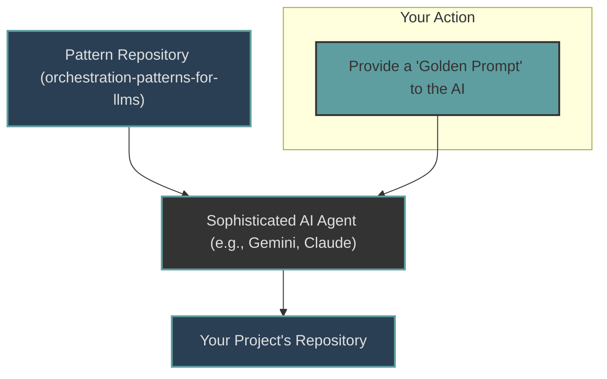

# Orchestration Patterns for LLM-Powered Agentic Development

This repository is a **template and example collection**, not a library to be installed. It provides a set of documents and concrete examples to help you establish an effective, AI-driven development workflow in your own projects.

Its purpose is to empower you to **delegate the implementation of this workflow to a sophisticated AI assistant.**

---

## 🤖 Core Concept

The goal is to use this pattern repository as a source of truth for an AI agent, which will then adapt and implement the workflow directly into your project.



---

## 🚀 How to Implement This Workflow

### **Approach #1: The AI-Powered Way (Recommended)**

The most effective way to use this repository is to instruct an AI assistant to do the work for you. This ensures a fast, accurate, and context-aware implementation.

**Your Task:** Copy the prompt template below, fill in your project's specific details, and give it to your AI assistant.

> **The Golden Prompt 🌟**
>
> ```md
> You are a System Architect AI. Your goal is to implement the agentic development workflow defined in this repository: https://github.com/pridiuksson/orchestration-patterns-for-llms
>
> You will be setting this up for my project, "[Your Project's Name]".
>
> First, analyze the pattern repository to understand the philosophy and see the concrete examples. Then, create a plan to apply this pattern to my project.
>
> Here is the essential context for my project:
> - **Project Language(s):** [e.g., TypeScript, Python]
> - **Frameworks/Libraries:** [e.g., React, Node.js, FastAPI]
> - **Source Code Directory:** `[e.g., src/, lib/, app/]`
> - **Test Command:** `[e.g., npm test, pytest]`
> - **Build Command:** `[e.g., npm run build]`
>
> Your plan must include these two phases:
>
> 1.  **Create Core Documentation:** Create the `agents.md`, `ARCHITECTURE.md`, and a project overview document (like `gemini.md`). These files should be adapted from the `docs/` in the pattern repository to reflect my project's specific details that I provided above.
>
> 2.  **Create Agent Execution Rules:** Create a `.cursor/rules/` directory. Populate it with specific agent rules adapted from the `examples/` in the pattern repository.
>
> **CRITICAL INSTRUCTION:** The agent execution rules you create **must be specific and contain the real paths and commands for my project.** Do not use generic placeholders like `[path/to/your/code]`. Use the actual context I provided. For example, if my source directory is `src/`, the rules should explicitly say `src/`.
>
> Please present your plan for my approval before you begin writing any files.
> ```

### **Approach #2: The Manual Way**

If you prefer a hands-on approach or do not have a suitable AI assistant, you can implement the pattern manually.

1.  **Study the Philosophy:** Read the documents in the `/docs` directory to understand the high-level concepts.
2.  **Analyze the Examples:** Review the concrete, working rules in the `examples/` directory.
3.  **Adapt and Create:** Follow the detailed steps in our **[IMPLEMENTATION_GUIDE.md](IMPLEMENTATION_GUIDE.md)** to create the necessary documentation and rules for your own project.

---

## Repository Contents

- **`/docs`**: Contains the generalized, high-level philosophy and documentation templates that explain the "why" behind the agentic workflow.
- **`/examples`**: Contains concrete, real-world `.cursor/rules/` files from a working project. These are not generic and serve as a specific implementation example.
- **`IMPLEMENTATION_GUIDE.md`**: A step-by-step guide for a manual implementation.

---

## License

This project is licensed under the MIT License. See the [LICENSE](LICENSE) file for details.