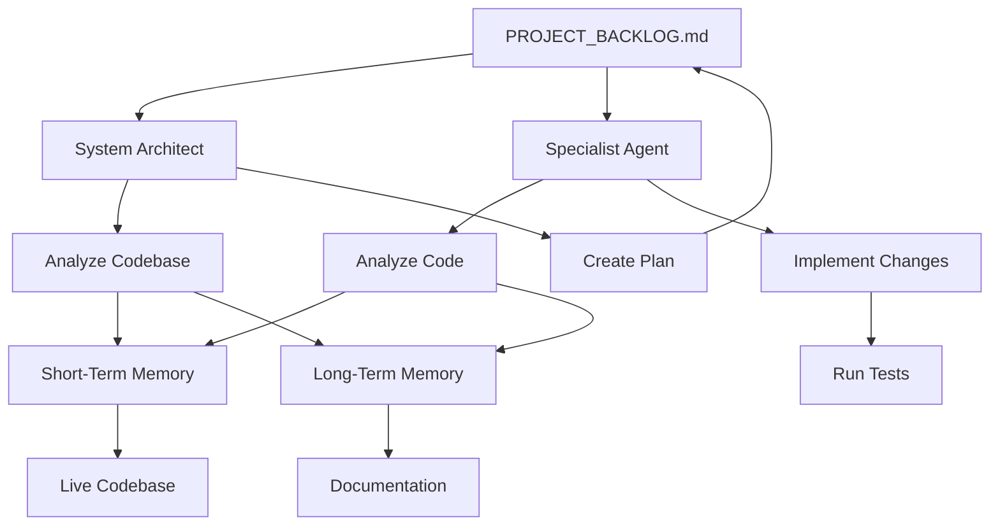
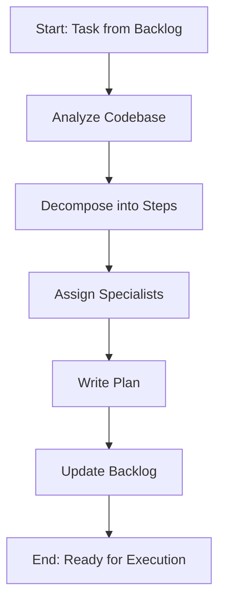
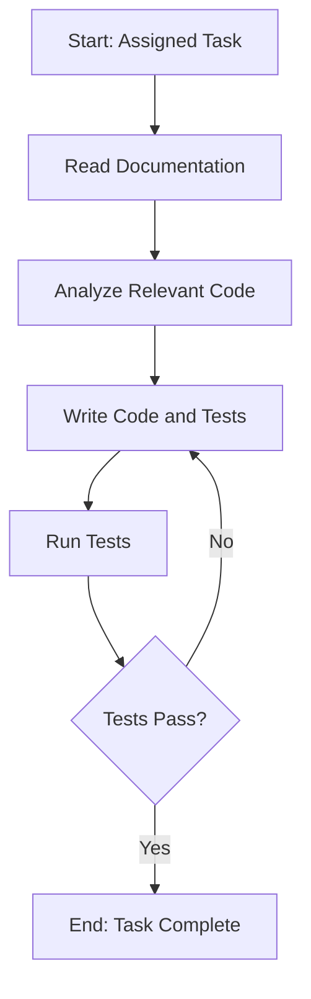

# System Architecture: [Your Project Name]

**Purpose**: To provide a concise, actionable overview of a project's architecture, principles, and core philosophies for AI development agents.

**Audience**: AI agents who need to understand the "what" and "why" behind the system's design.

---

## 1. Core Mission & Value

[Your Project Name] is a platform for [describe your project's core purpose and value proposition].

- **Feature 1**: [Describe a key feature]
- **Feature 2**: [Describe another key feature]
- **User Interface**: [Describe the UI/frontend if applicable]

---

## 2. Architectural Principles

This project is built on a set of core principles designed for stability, security, and maintainability.

- **Backend**: [e.g., Deno-based stateless Edge Functions on Supabase, Node.js with Express]
- **Database**: [e.g., PostgreSQL with Row-Level Security (RLS)]
- **AI Services**: All AI model interactions **MUST** go through an **AI Adapter Pattern** in `[path/to/your/ai_adapters]/`.
- **Dependency Management**: All dependencies are managed centrally via `[path/to/your/dependency_map.json]`.
- **Authentication**: [Describe your authentication model, e.g., a custom shared secret for admin functions and RLS for public access.]
- **Frontend**: [e.g., A TypeScript-based single-page application designed for local development.]

---

## 3. Core Philosophies

### **Code-First Documentation**
- The code is the single source of truth.
- Documentation **MUST NOT** duplicate code.
- Documentation **MUST** point to working code using semantic search patterns (e.g., "search for `functionName`").

### **Real API Testing**
- **NEVER** mock external service responses. Tests **MUST** use real APIs.
- **Why**: Real API testing is the only way to catch format variations, validate performance, and test against production-like conditions.
- Mock tests are explicitly forbidden as they create a false sense of security.

### **Type Safety First**
- Use a strongly-typed language like TypeScript to prevent runtime errors.
- All test data and interfaces should be strictly typed to ensure consistency.

---

## 4. System Components (Example)

### **Live API Endpoints**
| Method | Endpoint | Status | Notes |
|--------|----------|--------|-------|
| `GET`  | `/get-items` | ✅ Live | Paginated list of all public items. |
| `GET`  | `/get-item-details` | ✅ Live | Fetches a single item by its ID. |
| `POST` | `/process-item` | ✅ Live | **Admin Only.** Processes an item. |


### **Database Schema**
```sql
CREATE TABLE items (
  id bigint PRIMARY KEY GENERATED BY DEFAULT AS IDENTITY,
  created_at timestamptz DEFAULT now(),
  name text,
  description text
);
```

### **Test Structure**
```
tests/
├── fixtures/      # Type-safe test data
├── utils/         # Testing infrastructure
├── regression/    # Preventing critical regressions
└── integration/   # Real API + DB + AI testing
```

---

## 5. Critical Constraints & Known Issues

- **Constraint 1**: [e.g., Admin UI is local-only due to a known bug.]
- **Constraint 2**: [e.g., All AI model configurations are managed within the AI Adapters.]

**For detailed, step-by-step instructions on how to build, test, and troubleshoot the system, refer to `DEVELOPMENT.md`.**

---
## 🤖 **Agent Memory Architecture**

This project's AI agents operate on a two-tier memory model to effectively reason about and interact with the codebase.

*   **Short-Term Memory (The "Memory Bank"):** This is the live, active context of the entire codebase held within the IDE. It represents the *current state* of the code. Agents use their file system and search tools to access this volatile, high-resolution memory.

*   **Long-Term Memory (The "Persistent Knowledge"):** This is the project's documentation (`/ADR`, `ARCHITECTURE.md`, `DEVELOPMENT.md`). It represents the *intent*, architectural principles, and historical decisions behind the code. Agents consult this stable, low-resolution memory to guide their actions and ensure they align with the project's goals.

---

## 🤖 Agentic Workflow & Orchestration

This section documents the high-level workflow for the AI agent team. These diagrams provide the visual blueprint for how tasks are planned, executed, and verified.

### High-Level Process Flow

This diagram illustrates the end-to-end process. It shows how agents access both short-term (live codebase) and long-term (documentation) memory to execute their tasks.



### System Architect Workflow

The Architect is responsible for turning high-level goals into actionable plans.



### Feature Developer Workflow

Specialists perform the hands-on work, executing one atomic task at a time.


