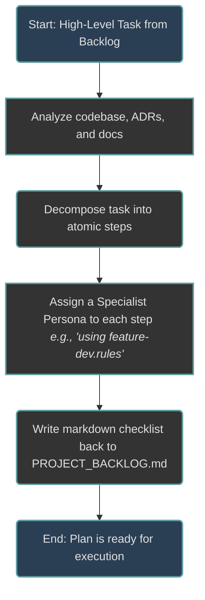
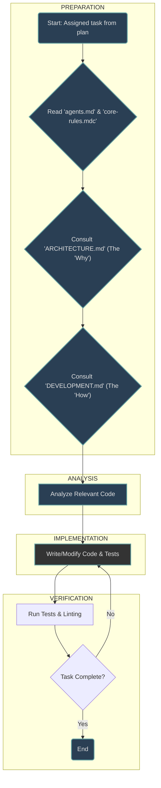

# Gemini Agent Orchestration Model

This document outlines the AI-driven development process for a software project. It defines the roles of different AI agent personas and the flow of work, ensuring a structured, predictable, and efficient development cycle. The model is inspired by a "Temporal Memory" architecture, where tasks and knowledge persist and evolve through different states, managed by specialized agents.

## 🗺️ Core Principle: Plan, Execute, Verify

The entire workflow is built on a simple, three-phase cycle:

1.  **Plan:** A `System Architect` agent analyzes a high-level goal and creates a detailed, step-by-step execution plan.
2.  **Execute:** Specialist agents (e.g., `Feature Developer`, `Docs Writer`) execute their assigned atomic tasks from the plan.
3.  **Verify:** All changes are validated against project standards, tests, and architectural principles before completion.

---

## 🌊 The High-Level Workflow

The complete agentic workflow, including visual diagrams, is the foundation of this project's architecture. It is formally documented in `ARCHITECTURE.md` under the **"Agentic Workflow & Orchestration"** section.

Please consult that document for a complete understanding of how AI agents plan, execute, and verify their work.

---

## 🧠 Agent Personas & Responsibilities

Each agent has a specific role and operates within a defined set of rules. All agents are governed by the foundational rules in 'core-rules.mdc'.

### 1. The `System Architect` (The Planner)

The Architect is responsible for turning high-level goals into actionable plans. It does not write production code.

**Workflow:**

### 2. The `Specialist Agents` (The Executors)

Specialists like `Feature Developer`, `Refactoring Engineer`, and `Docs Writer` perform the hands-on work. They execute one atomic task at a time.

**'Feature Developer' Workflow:**

---
## 📚 Knowledge & Memory Architecture

This project treats its documentation and codebase as a form of persistent memory, which agents use to inform their actions. The official definition of this model is documented in `ARCHITECTURE.md` under the "Agent Memory Architecture" section.